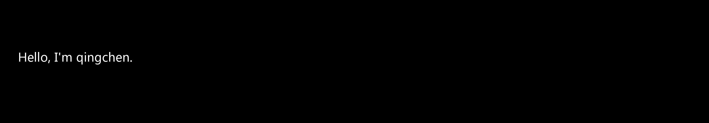

 
## Hi there 👋

**I am an Algorithm Engineer from China 🇨🇳**

About me

- 💼 Algorithm Engineer in NanJing

- ❤️ Interested in ML 、AI 、LLM 、NLP and so on

- 💬 Ask me about anything [here](https://github.com/qingchen177/qingchen177/issues)

[//]: # (<h2>🏆 Github Profile Trophy</h2>)

[//]: # ()

---

  
  

